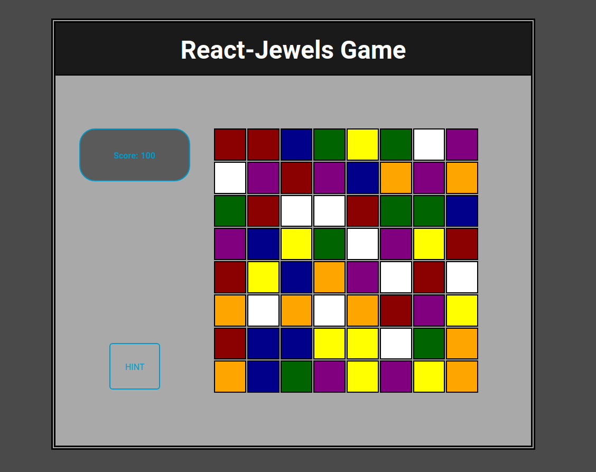

# React-Jewels game

This is a jewels matching game made using React.js with Hooks. Entire project is made just for fun.

The project was bootstrapped with Create React App, so just do:
```
    git clone https://github.com/DarkMannn/react-jewels.git .

    npm start
```

Here is a screenshot of the game:


